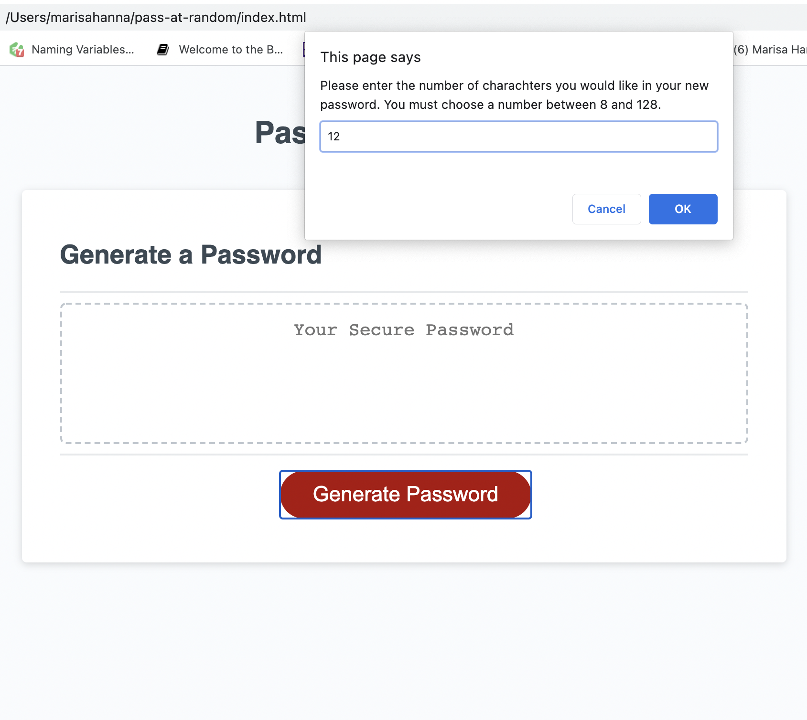
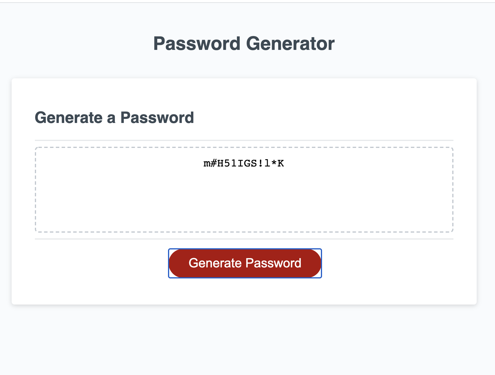

#   Pass-At-Random: Random Password Generator

#   Description

    This is my week three homework assignment. The task was to create a randomly generated password that held between 8 and 128 charachters. It must consist of upper case, lower case, numbers, and special charachters. The length of the password retruned was based on the user input captured from the prompt and confirm commands in the prompt boxes. The number of charachters generated must reflect the number of charachters requested from the user.

#   Images

#   Programming Languages Used

        *HTML
        *CSS
        *JavaScript

#   Contributors

    Marisa Hanna

#   Link To Deployed Application    

   [Project Link](https://marisahanna.github.io/pass-at-random/)

